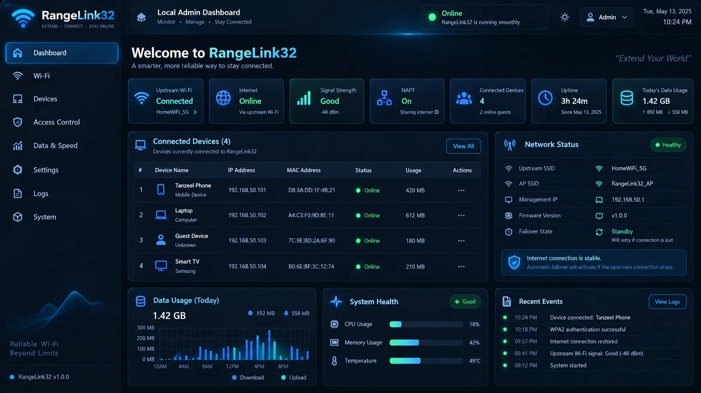
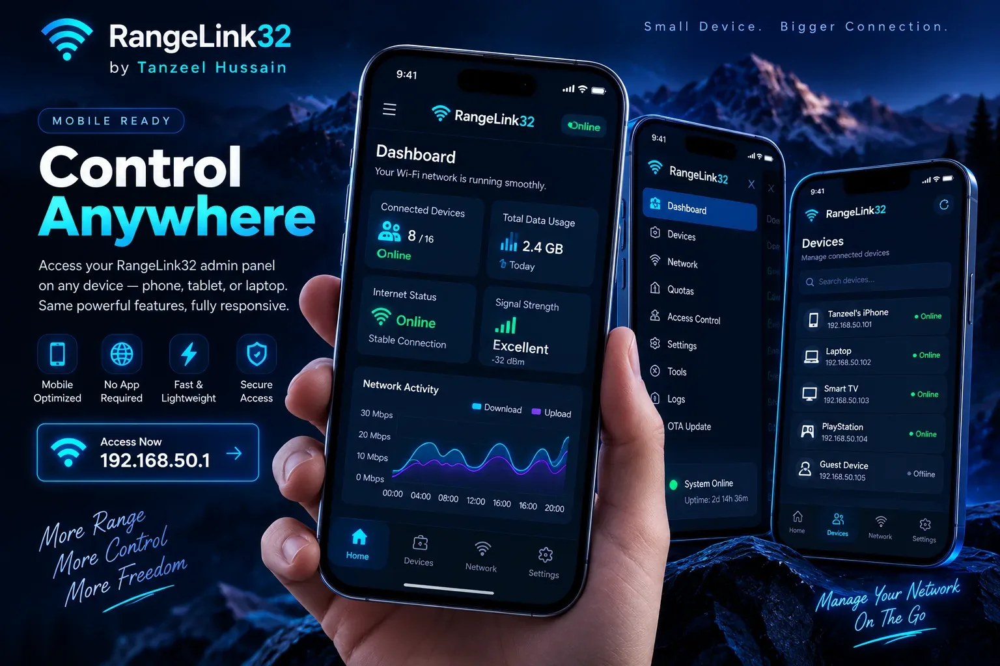
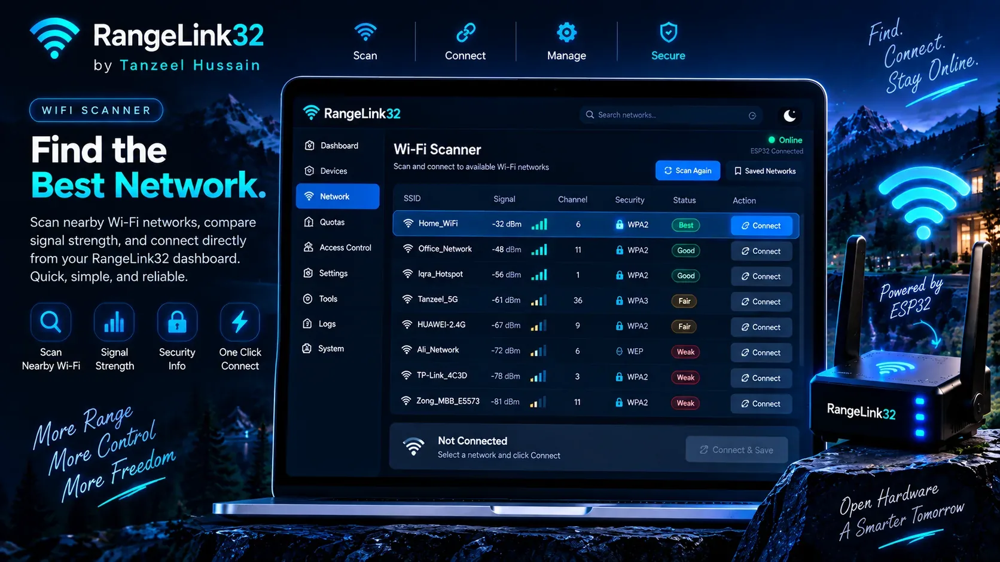
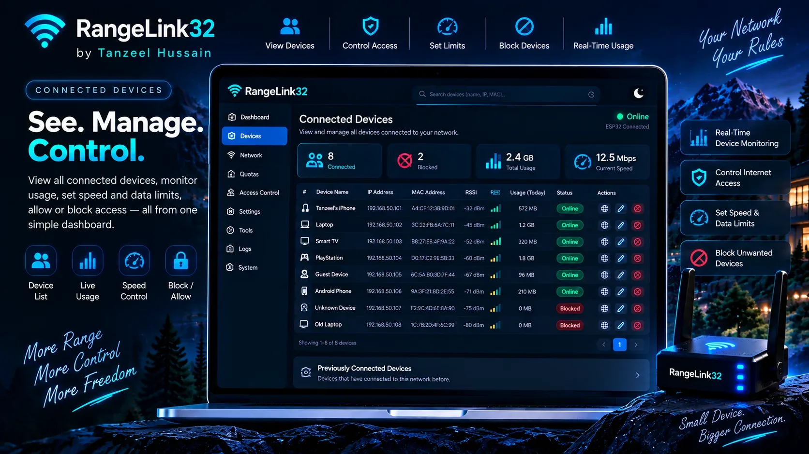
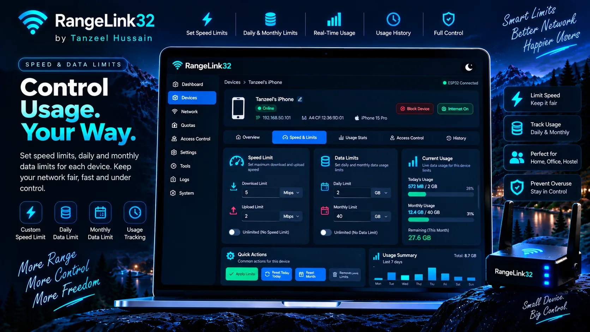
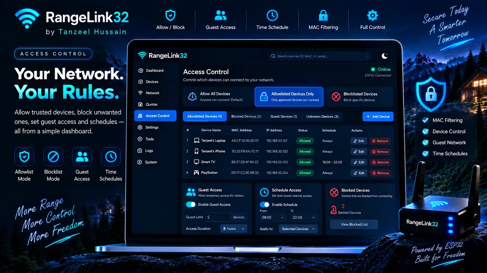
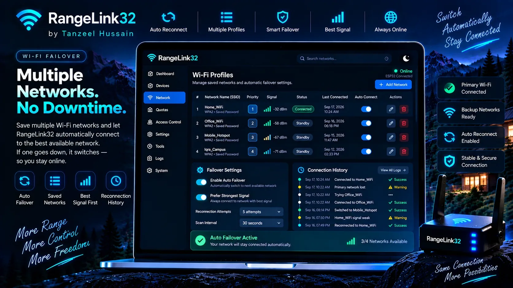
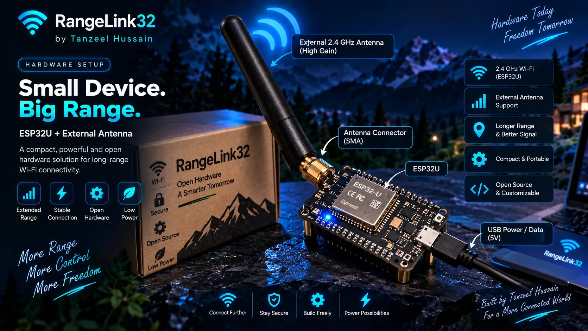

<div align="center">

<a href="https://tanzeel0hussain.github.io/RangeLink32/"></a>

# RangeLink32

### Smart ESP32U Wi-Fi Extender & Managed Gateway

[](https://github.com/Tanzeel0Hussain/RangeLink32/actions/workflows/firmware.yml)
[](https://tanzeel0hussain.github.io/RangeLink32/)
[](https://github.com/Tanzeel0Hussain/RangeLink32/releases/tag/v1.0.1)
[](docs/HARDWARE.md)
[](LICENSE)

**Extend Wi-Fi. Control access. Manage every device from a local router-style dashboard.**

[Install RangeLink32](https://tanzeel0hussain.github.io/RangeLink32/#start) ·
[Download Full Firmware](https://github.com/Tanzeel0Hussain/RangeLink32/releases/download/v1.0.1/rangelink32-full.bin) ·
[Release v1.0.1](https://github.com/Tanzeel0Hussain/RangeLink32/releases/tag/v1.0.1) ·
[Hardware Notes](docs/HARDWARE.md)

</div>

---

## What is RangeLink32?

RangeLink32 is an **ESP32U-powered 2.4 GHz Wi-Fi extender and managed gateway**. The ESP32 connects to an authorized upstream Wi-Fi network, keeps its own local Wi-Fi network available for your devices, and forwards Internet traffic using NAPT.

It is designed to behave like a small router-style network appliance instead of a basic demo. From the local admin page you can scan Wi-Fi networks, save multiple upstream profiles, reconnect automatically, manage connected clients, block or approve devices, apply daily/monthly data limits, set approximate speed caps, configure access schedules, review logs, change passwords, update firmware and monitor system health.

> **Important:** RangeLink32 uses one ESP32 2.4 GHz radio for both upstream and downstream traffic. It is a practical embedded gateway project, not a replacement for a commercial dual-radio/dual-band router.

---

## Start Here — First Installation

1. Connect the ESP32U to a computer with a **data-capable USB cable**.
2. Open the **[RangeLink32 live installer](https://tanzeel0hussain.github.io/RangeLink32/#start)** in a Chromium-based desktop browser with Web Serial support.
3. Click **Install RangeLink32** and select the ESP32 serial device.
4. After flashing, connect your phone/laptop to **`RangeLink32-Setup`**.
5. Enter the default RangeLink32 Wi-Fi password **`rangelink32`**.
6. Open **`http://192.168.50.1`**.
7. Log in with **username `admin`** and **admin password `changeme32`**.
8. On first boot, RangeLink32 **requires** you to replace both factory passwords before the normal dashboard is unlocked.
9. Reconnect with the new hotspot password and sign in using the new admin credentials.
10. Scan for your authorized upstream Wi-Fi network, enter its password, save the profile and connect.

### Default First-Boot Credentials

| Purpose | Default |
|---|---|
| RangeLink32 Wi-Fi SSID | `RangeLink32-Setup` |
| RangeLink32 Wi-Fi password | `rangelink32` |
| Admin page | `http://192.168.50.1` |
| Admin username | `admin` |
| Admin password | `changeme32` |

**The Wi-Fi password and admin password are intentionally different.** Factory credentials are setup-only: the normal dashboard stays locked until both factory passwords are replaced. The firmware also rejects a new hotspot password if it matches the admin password, and rejects a new admin password if it matches the hotspot password. Factory reset restores the setup credentials and therefore re-enables the mandatory first-boot security screen.

### Changing the two passwords

Inside the local admin dashboard:

- **RangeLink32 Hotspot Settings** changes the SSID/password used by phones, laptops and other devices to join the ESP32 network. After saving, the ESP32 restarts and you reconnect with the new hotspot credentials.
- **Admin Login Settings** changes the username/password used to open the protected management dashboard. It is independent from the hotspot password.

Both passwords require at least 8 characters and are stored in protected application form.

---

## Product Architecture

```text
                         Internet
                            │
                    Main 2.4 GHz Wi-Fi
                            │
                      ESP32 STA side
                            │
               ┌────────────────────────┐
               │       RangeLink32      │
               │     ESP32U + antenna   │
               │                        │
               │  Saved Wi-Fi profiles  │
               │  Auto reconnect        │
               │  Failover              │
               │  NAPT forwarding       │
               │  Traffic accounting    │
               │  Access control        │
               │  Local web admin       │
               └────────────┬───────────┘
                            │
                       ESP32 AP side
                            │
              ┌─────────────┼─────────────┐
              │             │             │
            Phone         Laptop       Smart TV
```

---

## Feature Summary

| Network & Recovery | Device Control | Data & Speed | Management |
|---|---|---|---|
| STA + AP + NAPT | MAC/IP inventory | Upload/download counters | Protected local admin |
| Nearby Wi-Fi scan | Allow / block | Daily MB/GB quota | Change hotspot credentials |
| Saved profiles | Allowlist-only mode | Monthly MB/GB quota | Change admin credentials |
| Auto reconnect | Guest access | Approx. Kbps/Mbps caps | OTA firmware update |
| Automatic failover | Time schedules | Usage reset controls | Logs, backup & restore |
| RSSI/channel visibility | Custom device names | Automatic quota cutoff | Watchdog & health checks |

---

# Project Gallery

The same eight visuals used on the professional live website are included below so the complete project workflow can be understood directly from the repository.

## 01 — Dashboard Overview



This is the main router-style dashboard. It is designed to give the administrator an immediate view of the RangeLink32 state: upstream Wi-Fi connection, Internet reachability, signal quality, NAPT forwarding status, connected clients, uptime and traffic information. This is the first operational screen after signing in to the local admin panel.

---

## 02 — Mobile Responsive Admin View



The administration interface is designed to work on a phone as well as a laptop. Navigation, cards and device controls reorganize for a smaller screen instead of forcing a desktop layout. The public product website is also responsive, while the local dashboard remains accessible at **`192.168.50.1`** from a device connected to RangeLink32.

---

## 03 — Wi-Fi Scanner & Upstream Network Selection



The Wi-Fi scanner discovers nearby 2.4 GHz networks and presents useful connection information such as **SSID, RSSI/signal strength, channel and security state**. From here the administrator can choose an authorized upstream Wi-Fi network, enter its password, save the profile and connect RangeLink32 to the Internet source.

Saved upstream passwords are protected by the firmware rather than exposed in the normal profile API.

---

## 04 — Connected Client Manager



This screen represents the device inventory. RangeLink32 tracks currently connected and previously seen clients and associates them with information such as **MAC address, local IP address, RSSI, connection state, custom device name and usage counters**.

From the management workflow, the administrator can approve, block or otherwise apply policy to individual devices.

---

## 05 — Speed, Daily Quota & Monthly Quota Controls



Each device can have its own Internet policy. RangeLink32 supports:

- an approximate **speed cap** in Kbps/Mbps,
- a **daily data limit** in MB/GB,
- a **monthly data limit** in MB/GB,
- daily/monthly usage counters,
- manual daily/monthly usage reset controls.

When a configured data quota is exhausted, Internet forwarding for that client is denied until the applicable usage period is reset. Bandwidth limiting is implemented as embedded traffic shaping and should be treated as approximate rather than carrier-grade QoS.

---

## 06 — Access Control, Allowlist, Blocklist & Guest Rules



The access-control system allows the administrator to decide which devices may use the RangeLink32 Internet connection. Policies include **allow-all**, **allowlist-only**, individual blocking/approval, temporary guest access and time schedules.

MAC/IP/device information helps identify clients, while policy data is persisted so the same device can keep its configured access rules after a restart.

---

## 07 — Saved Wi-Fi Profiles, Auto Reconnect & Failover



RangeLink32 can remember multiple authorized upstream Wi-Fi profiles. If the current upstream connection disappears or becomes unavailable, the firmware repeatedly attempts recovery and can choose another saved network according to the available signal/profile logic.

The goal is that the local RangeLink32 network remains manageable even when the upstream Internet source has failed, so you do not need to physically walk back to the ESP32 just to change its connection.

---

## 08 — ESP32U + External Antenna Hardware



The intended hardware target is a **classic ESP32 / ESP32U-style board with external 2.4 GHz antenna support**. The external antenna can improve the RF link when the correct board/module, antenna path, antenna orientation and placement are used.

RangeLink32 should be placed where it still receives a stable upstream router signal while also being closer to the area that needs coverage. Real-world range and throughput depend on the actual board, antenna, obstructions, interference and regulatory limits.

---

## How the Network Behaves

When RangeLink32 is operating normally:

1. The ESP32 station interface connects to the selected upstream Wi-Fi.
2. The RangeLink32 access point remains available for downstream devices.
3. Downstream clients receive local addresses from the RangeLink32 network.
4. NAPT forwards permitted Internet traffic through the upstream Wi-Fi.
5. Traffic accounting records client usage.
6. MAC policy, guest rules, schedules, daily/monthly quota limits and speed caps are applied.
7. If upstream Wi-Fi drops, the reconnect/failover logic keeps trying without requiring physical access to the board.
8. The local admin interface remains the control point for configuration and recovery.

---

## Browser Installer & Firmware Downloads

The easiest first-install method is the browser installer:

**[Open RangeLink32 Installer](https://tanzeel0hussain.github.io/RangeLink32/#start)**

The **[v1.0.1 release](https://github.com/Tanzeel0Hussain/RangeLink32/releases/tag/v1.0.1)** includes:

| Firmware file | Purpose |
|---|---|
| `rangelink32-full.bin` | Combined first-install image; flash from offset `0x0` |
| `rangelink32-ota.bin` | Application image for the local OTA updater; the updater requires its official SHA-256 digest |

Direct first-install firmware: **[Download `rangelink32-full.bin`](https://github.com/Tanzeel0Hussain/RangeLink32/releases/download/v1.0.1/rangelink32-full.bin)**

---

## Build from Source

Requirements: PlatformIO and a supported classic ESP32 development target.

```bash
git clone https://github.com/Tanzeel0Hussain/RangeLink32.git
cd RangeLink32
pio run -e esp32dev
```

Upload:

```bash
pio run -e esp32dev -t upload
```

Serial monitor:

```bash
pio device monitor -b 115200
```

---

## Password & Credential Security

The project separates three different credential types:

1. **RangeLink32 hotspot password** — used by phones/laptops joining the ESP32 AP.
2. **RangeLink32 admin password** — used to protect the local management page.
3. **Saved upstream Wi-Fi passwords** — credentials for authorized router/hotspot networks that RangeLink32 connects to.

The hotspot password and admin password can be changed independently from the local dashboard and are not allowed to be set to the same value. The local admin challenge uses HTTP Digest authentication instead of Basic authentication. This avoids sending a reusable Base64 username/password value on each request, but the local management page is still HTTP rather than TLS, so it should be used only on a trusted RangeLink32 network.

Saved upstream Wi-Fi credentials, the RangeLink32 hotspot password and the admin password are stored in AES-GCM protected application form using a random per-device master secret that is generated on first boot and mixed with the chip identity. Saved upstream secrets are not included in the normal profile API or safe settings backup, and revealing a saved upstream password requires administrator re-authentication.

For stronger resistance to physical flash extraction, ESP32 Secure Boot and hardware flash encryption are separate hardening layers that can be added depending on deployment requirements.

---

## Repository Structure

```text
RangeLink32/
├── assets/
│   ├── rangelink32-readme-hero.svg
│   ├── rangelink32-hero.webp
│   ├── 01-dashboard-overview.webp
│   ├── 02-mobile-responsive-view.webp
│   ├── 03-wifi-scanner.webp
│   ├── 04-client-manager.webp
│   ├── 05-speed-data-limits.webp
│   ├── 06-access-control.webp
│   ├── 07-wifi-failover.webp
│   ├── 08-esp32u-hardware.webp
│   ├── site.css
│   └── site.js
├── docs/
│   ├── firmware/
│   └── HARDWARE.md
├── firmware/
│   ├── include/
│   └── src/
├── .github/workflows/
├── index.html
├── manifest.json
├── platformio.ini
├── SECURITY.md
└── LICENSE
```

---

## Validation Status

| Area | Status |
|---|---|
| Host policy/failover logic tests | ✅ Automated in CI |
| Firmware CI compile | ✅ Passing |
| Browser-installable firmware generation | ✅ Passing |
| GitHub Pages deployment | ✅ Passing |
| Responsive public website | ✅ Implemented |
| Device policy / quota code | ✅ Implemented |
| Physical ESP32U range test | ⏳ Required on real hardware |
| Sustained throughput / long-duration stability | ⏳ Required on real hardware |

The software repository and deployment pipeline can be verified automatically. RF range, antenna behavior, real throughput and long-duration stability must be measured on the actual ESP32U hardware.

---

## License

RangeLink32 is released under the [MIT License](LICENSE).

<div align="center">

### RangeLink32 — More range. More control.

Built by **Tanzeel Hussain**

</div>
